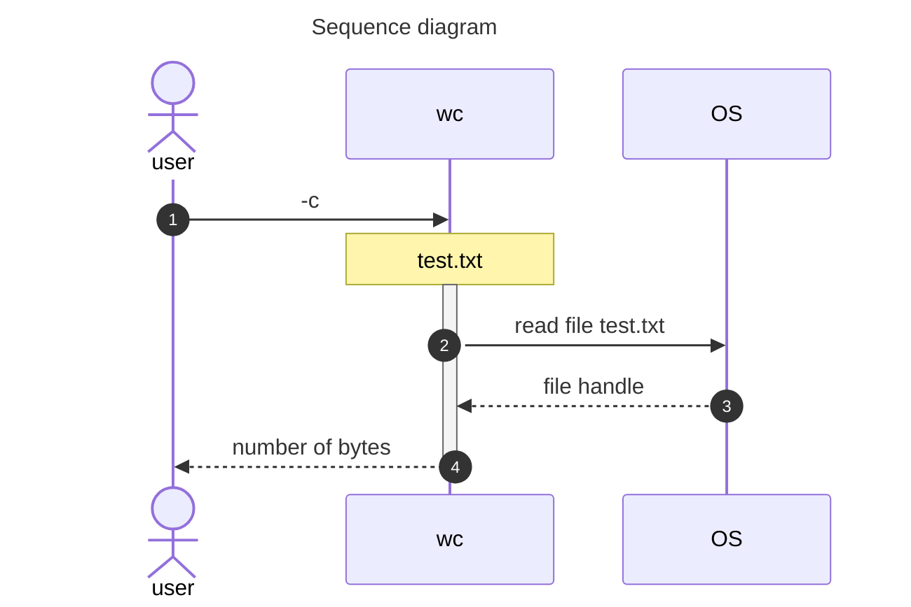
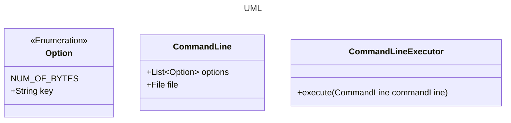

### Step 1

In this step your goal is to write a simple version of wc, let’s call it ccwc (cc for Coding Challenges) 
that takes the command line option `-c` and outputs the number of bytes in a file.

If you’ve done it right your output should match this:

```shell
>ccwc -c test.txt
342190 test.txt
```



